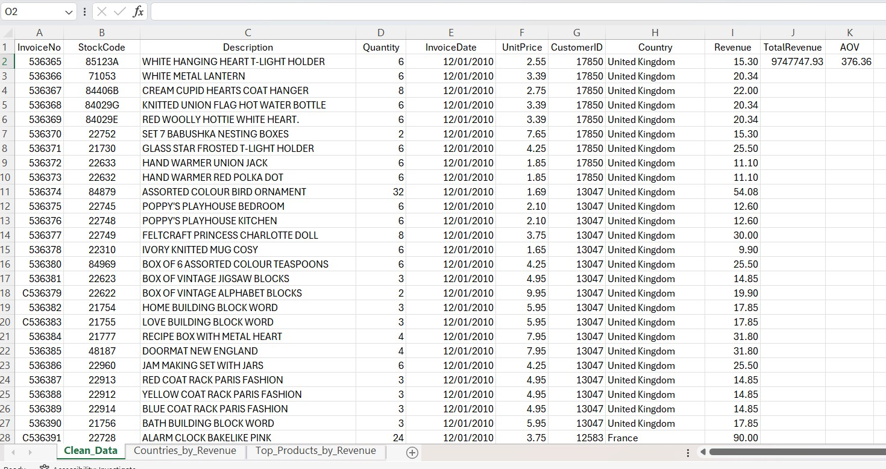
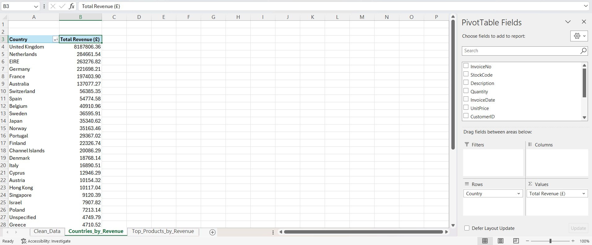
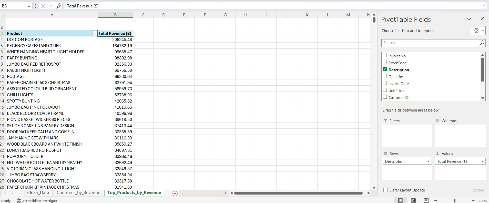

# E-commerce Sales Analysis

**End-to-end Excel-based analysis of retail transaction data**

This project is part of my ongoing data analytics journey.  
I wanted to take a real, messy dataset and turn it into clear insights that support business decision-making - exactly what analysts do in real roles.

The focus was on cleaning the data, building core KPIs, and identifying patterns that matter from a commercial perspective.

---

## Tools & Skills Demonstrated
- Microsoft Excel (cleaning, formatting, formulas, data types)
- PivotTables & PivotCharts
- KPI development (Revenue, AOV, Top Countries, Top Products)
- Data validation & duplicate handling
- Structured analysis workflow
- Version control (GitHub)

---

## Key Metrics
- **Total Revenue:** £9,747,747.93  
- **Average Order Value (AOV):** £376.36  
- **Top Country by Revenue:** United Kingdom  
- **Top Product by Revenue:** *“Dotcom Postage”*

---

## Business Insights
- United Kingdom dominates revenue, representing the majority of all sales.  
- The high AOV suggests customers typically purchase multiple items per order.  
- A small set of high-performing products drives a disproportionate share of revenue - useful for inventory and marketing priorities.  
- Seasonal items and gifting categories create noticeable sales spikes.  
- Several smaller international markets show potential for targeted growth.

---

## Data Cleaning Summary

The original dataset contained:
- inconsistent date formats  
- mixed timestamps  
- duplicate customer IDs  
- irregular product descriptions  
- numeric values stored as text  

Cleaning steps included:
- normalising all dates into a single format  
- removing duplicate customer records  
- standardising numeric fields  
- creating a clean revenue calculation  
- separating raw data from KPI sheets for better structure  

The cleaned file is provided as:  
**`ecommerce_clean.xlsb`**

---

## Repository Structure

- `ecommerce_clean.xlsb` – cleaned Excel dataset  
- `README.md` – project documentation  
- `images/` – screenshots (to be added)

---

## Screenshots

### Cleaned Dataset

### Countries by Total Revenue (£)

### Top Products by Total Revenue (£)

---

## Why This Project?

I chose this project to strengthen my ability to:
- clean and structure real-world data,  
- extract business-relevant KPIs,  
- communicate insights clearly and visually.

This is the type of analytical work I enjoy — taking something chaotic and turning it into something meaningful and actionable.

---

## Next Steps
- Build an interactive Power BI version of this analysis  
- Recreate core KPIs using SQL  
- Add visual trend analysis (seasonality, customer behaviour)

---

## Contact
This repository is part of my learning journey as I transition into data analytics.  
Feedback, suggestions, or advice are always welcome.
